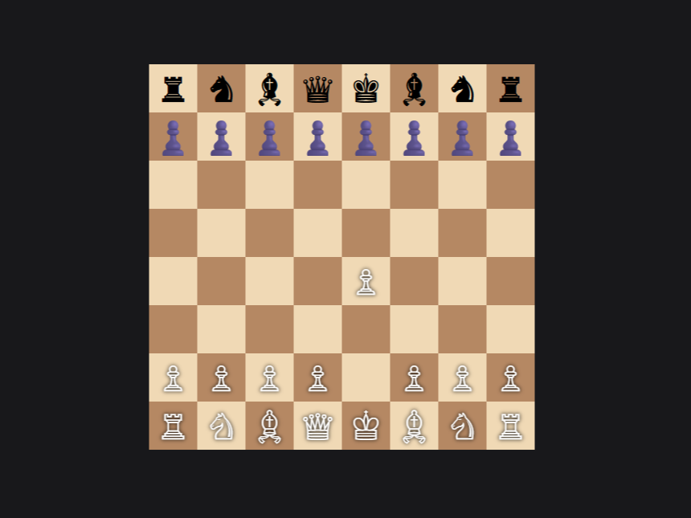

# ♟️ Real-Time Multiplayer Chess

A real-time multiplayer chess application built with **Node.js**, **Express**, **Socket.IO**, and **Chess.js**.  
This project enables two players to play chess live in the browser with synchronized board states and spectator support.

---

## 🚀 Features

- ⚡ Real-time multiplayer gameplay using WebSockets
- ♟️ Drag-and-drop chess movement
- 👥 Automatic White / Black player assignment
- 👀 Unlimited spectators support
- 🔄 Live board synchronization
- 🧠 Move validation using Chess.js
- 🎨 Clean responsive UI with Tailwind CSS
- 📡 Socket.IO powered communication
- 🏗️ Scalable folder structure

---

# 📸 Preview



---

# 🛠️ Tech Stack

| Technology | Purpose |
|------------|----------|
| Node.js | Backend Runtime |
| Express.js | Web Framework |
| Socket.IO | Real-time Communication |
| Chess.js | Chess Logic & Validation |
| EJS | Templating Engine |
| Tailwind CSS | Styling |
| Vanilla JavaScript | Frontend Logic |

---

# 📂 Project Structure

```bash
CHESS/
│
├── public/
│   ├── css/
│   │   └── style.css
│   │
│   └── js/
│       └── main.js
│
├── views/
│   └── index.ejs
│
├── app.js
├── package.json
├── package-lock.json
└── .gitignore
```

---

# ⚙️ Installation & Setup

## 1️⃣ Clone the Repository

```bash
git clone https://github.com/vbv18/Chess.git
cd Chess
```

---

## 2️⃣ Install Dependencies

```bash
npm install
```

---

## 3️⃣ Start the Server

```bash
node app.js
```

---

## 4️⃣ Open in Browser

```bash
http://localhost:3000
```

---

# 🧠 How It Works

## 🔌 Socket Connection

When a user connects:

- First user → assigned **White**
- Second user → assigned **Black**
- Additional users → become **Spectators**

---

## ♟️ Move Handling

Moves are:

1. Captured from drag-and-drop interaction
2. Sent to the server using Socket.IO
3. Validated using Chess.js
4. Broadcasted to all connected clients

---

## 🔄 Board Synchronization

Every successful move updates:

- FEN board state
- Current player turn
- All connected clients in real time

---

# 📡 Socket Events

| Event | Description |
|------|-------------|
| `connection` | User connects |
| `playerRole` | Assigns player color |
| `spectatorRole` | Assigns spectator |
| `move` | Sends move data |
| `boardState` | Sends updated FEN |
| `disconnect` | Removes disconnected player |

---

# 🎯 Current Capabilities

✅ Legal move validation  
✅ Real-time synchronization  
✅ Spectator mode  
✅ Responsive chessboard  
✅ Turn-based movement restriction  

---

# 🚧 Future Improvements

- ⏳ Chess clocks / timers
- ♜ Castling & promotion UI improvements
- 🤝 Matchmaking system
- 🧾 Move history panel
- 🔄 Game restart functionality
- 💬 In-game chat
- 🏆 ELO ranking system
- 📱 Mobile touch support
- 🔐 Authentication system
- ♛ Stockfish AI integration

---

# 🧪 Example Gameplay Flow

```text
Player 1 joins → Assigned White
Player 2 joins → Assigned Black
Players move alternately
Server validates moves
Board updates for everyone instantly
Additional users watch as spectators
```

---

# 🔒 Move Validation Logic

Moves are validated server-side using:

```javascript
const result = chess.move(move);
```

Invalid moves are rejected automatically to prevent cheating or desynchronization.

---

# 💻 Core Dependencies

```json
{
  "express": "^5.x",
  "socket.io": "^4.x",
  "chess.js": "^1.x",
  "ejs": "^5.x",
  "http": "^0.x"
}
```

---

# 🧑‍💻 Author

### Vaibhav Garg

ECE Undergraduate • Full Stack Developer • Systems & AI Enthusiast

---

# 📜 License

Feel free to use, modify, and distribute this project.

---

# ⭐ Support

If you liked this project:

- ⭐ Star the repository
- 🍴 Fork the project
- 🛠️ Contribute improvements
- 📢 Share with others
